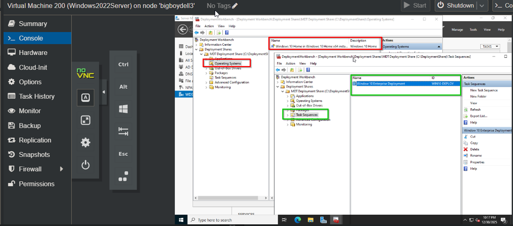
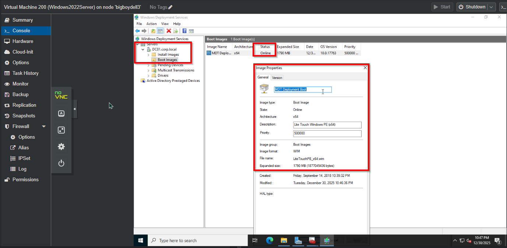
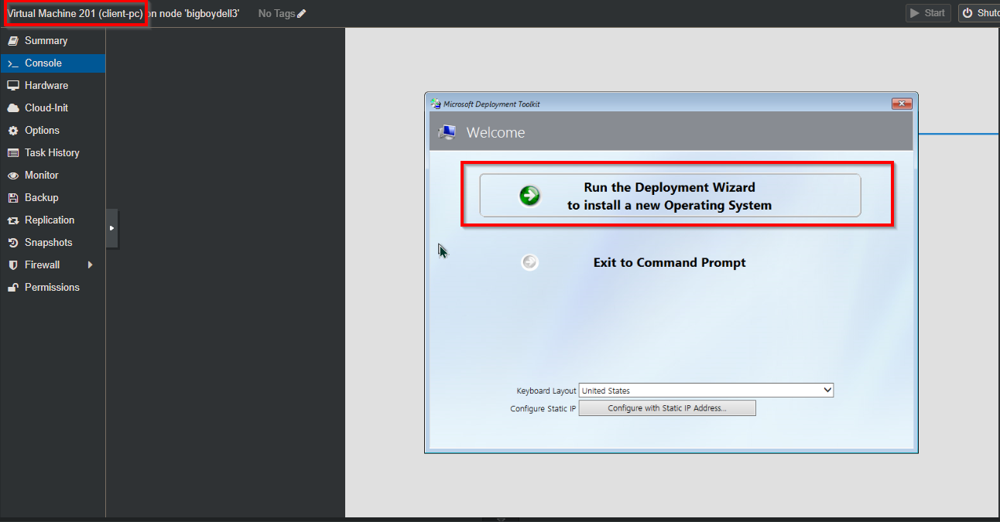

# Enterprise-Automated-Desktop-Deployment

## 🎯 Objective
To replace manual, time-consuming workstation setups with a standardized, "Zero-Touch" imaging solution. This project utilizes **Windows Deployment Services (WDS)** and **Microsoft Deployment Toolkit (MDT)** to PXE boot bare-metal clients and automatically deploy a custom Windows 10/11 Enterprise image with drivers and applications pre-configured.

## 🛠 Skills Applied
- **Systems Administration:** Configured WDS to handle PXE (Preboot Execution Environment) requests and DHCP integration.
- **Image Management:** Created "Golden Images" using MDT, managing Operating System .wim files and driver injection.
- **Task Sequence Automation:** Built custom Task Sequences to automate partitioning, domain joining, and local admin creation.
- **Infrastructure Standardization:** Enforced consistent OS configurations across all endpoints to reduce support ticket volume.

## 💻 Technologies
- **Platform:** Windows Server 2022 (Standard)
- **Tools:** Microsoft Deployment Toolkit (MDT), Windows Deployment Services (WDS), Windows ADK (Assessment & Deployment Kit)
- **Client OS:** Windows 10/11 Enterprise

## 📝 Project Workflow

### 1. MDT Workbench Configuration
Established the `DeploymentShare` directory structure and imported the base Windows operating system files. Created a "Standard Client Task Sequence" to define the installation logic (Partition Disk -> Install OS -> Inject Drivers -> Join Domain).

### 2. WDS & Boot Image Integration
Generated a custom `LiteTouchPE_x64.wim` boot image within MDT and imported it into the WDS Boot Images repository. Configured the WDS Responder to listen for PXE requests from unknown clients on the network.

### 3. Execution (PXE Boot & Deployment)
Successfully PXE booted a blank Virtual Machine client. The client received an IP from DHCP, loaded the MDT Boot Image, and executed the Task Sequence to install Windows completely hands-free.

## 🔧 Troubleshooting & Challenges
- **Issue:** Client VM failed to find a boot filename during PXE.
- **Resolution:** Verified WDS service status and adjusted DHCP Option 60 (PXEClient) since DHCP and WDS were hosted on the same server.
- **Optimization:** Implemented a "SkipWelcome" rule in `CustomSettings.ini` to remove the initial "Welcome to MDT" prompt, saving 2 clicks per deployment.
