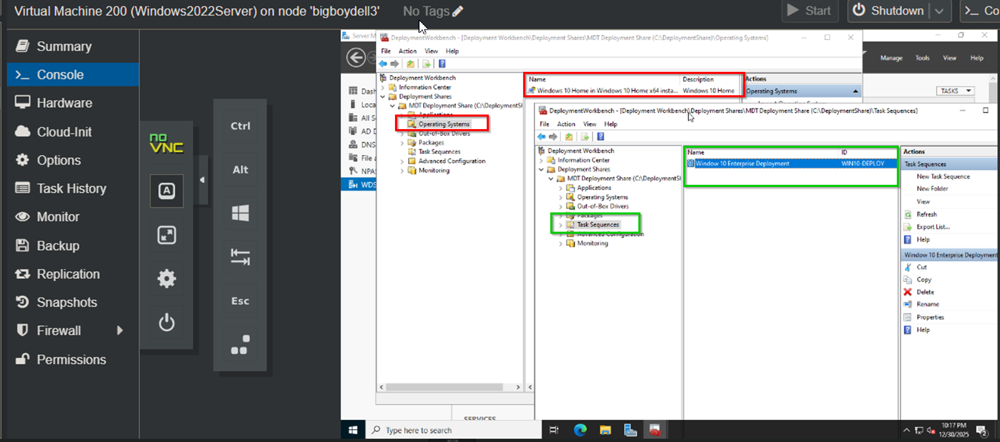
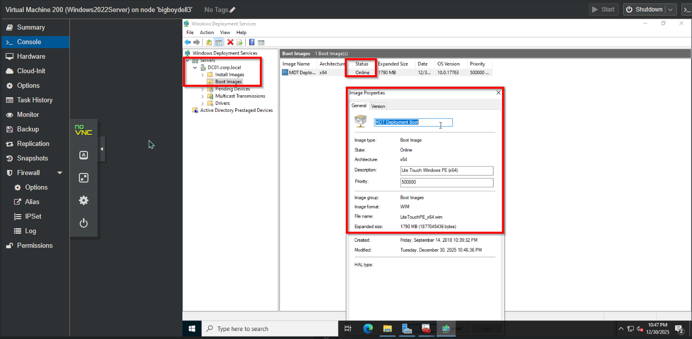
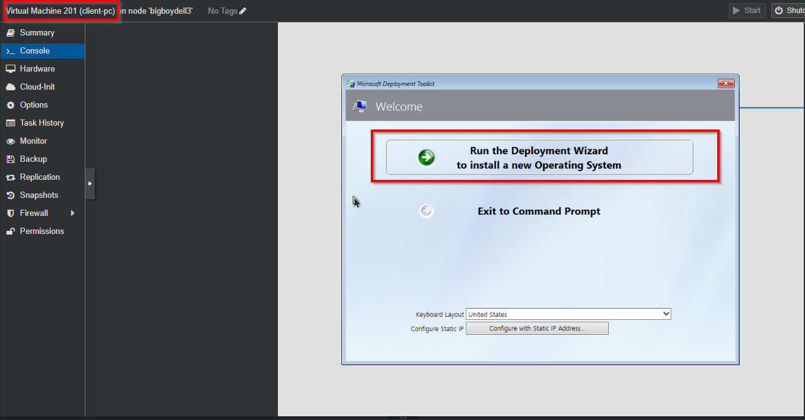

# Hands-Free Windows Deployment with MDT and WDS

Bare-metal Windows 10/11 Enterprise deployment over PXE. A blank machine boots from the network, pulls the MDT boot image from WDS, and runs a task sequence that partitions the disk, installs Windows, injects drivers, and joins the domain without anyone touching it.

## Stack

- Windows Server 2022 Standard running WDS and DHCP
- Microsoft Deployment Toolkit (MDT) and the Windows ADK
- Windows 10/11 Enterprise clients, tested on a blank VM

## Build

### 1. MDT deployment share
Created the `DeploymentShare`, imported the Windows source files, and built a standard client task sequence: partition disk, install OS, inject drivers, join domain.

### 2. Boot image in WDS
Generated `LiteTouchPE_x64.wim` in MDT, added it to the WDS boot images, and set WDS to answer PXE requests from unknown clients.

### 3. PXE deployment
PXE booted a blank VM. It got an address from DHCP, loaded the MDT boot image, and ran the task sequence through to a finished install with no input.

## Problems I hit and how I fixed them

### Competing DHCP servers
- **Symptom:** The client got an IP address but never found the WDS server.
- **Cause:** My home router's DHCP answered first, and its offer had no PXE boot information (options 66/67).
- **Fix:** Installed the DHCP role on the Windows server with a dedicated scope (`192.168.x.200-.210`) carrying the boot options, and authorized it in AD.
- **Note:** Authorizing a DHCP server in AD doesn't make it win. It only allows a Windows DHCP server to start in the domain, and two DHCP servers on one subnet is a race. In production I'd keep one DHCP server per subnet and forward PXE requests to WDS with IP helpers.

### WDS and DHCP on the same server
- **Symptom:** Error `0xC1040103` when setting DHCP option 60 from PowerShell.
- **Cause:** The DHCP Server role wasn't installed yet, so the WDS configuration command failed.
- **Fix:** Installed DHCP, then set WDS to "Do not listen on DHCP ports" (UDP 67 belongs to the DHCP service when both run on one server) and set option 60 to `PXEClient` so clients know a PXE server is present.

### PXE timeout
- **Symptom:** "PXE Boot Aborted" because the press-F12 window closed before the virtual console caught up.
- **Fix:** Changed the WDS boot policy for unknown clients to "Always continue the PXE boot," which removed the F12 prompt.

### Firewall blocking TFTP
- **Symptom:** The boot image download hung.
- **Cause:** Windows Defender Firewall was on for the domain profile.
- **Fix:** Allowed UDP 67 (DHCP) and UDP 69 (TFTP) inbound.

## Terminology note
Standalone MDT is Lite Touch; the boot image is literally named `LiteTouchPE`. Microsoft reserves "Zero Touch" for MDT integrated with Configuration Manager. This build is Lite Touch with the wizard automated, so it runs hands-free.
